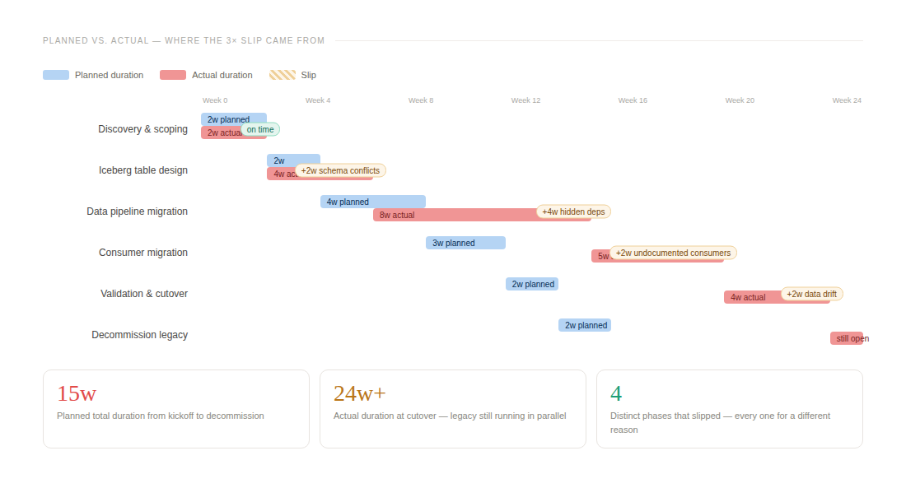
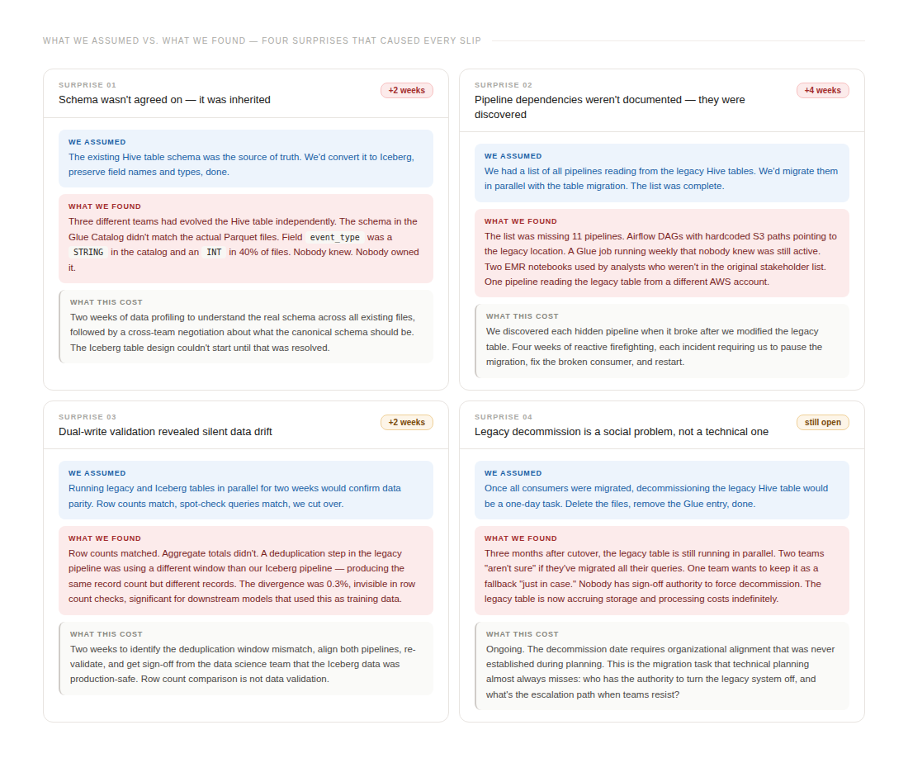
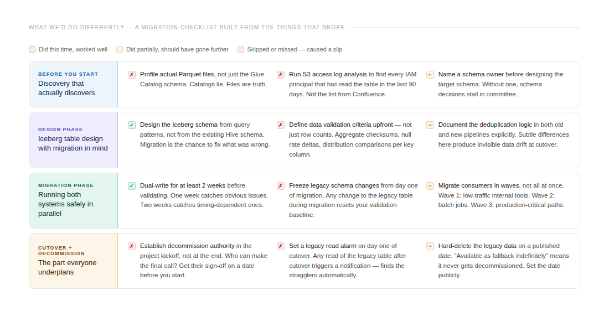

# The Data Lakehouse Migration That Took 3× Longer Than Planned (and Why)

## The Data Lakehouse Migration That Took 3× Longer Than Planned (and Why)

A post-mortem on the hidden complexity of moving from Hive to Iceberg in production

3 visuals exported. Full article:

## The Data Lakehouse Migration That Took 3× Longer Than Planned (and Why)

A post-mortem on the hidden complexity of moving from Hive to Iceberg in production

We planned fifteen weeks. We used twenty-four. The legacy table is still running.

This is the honest account of a data lakehouse migration at FPT Smart Cloud — moving a production Hive table that fed AI/NLP training pipelines into an Apache Iceberg-based lakehouse architecture on MinIO. The technical case for Iceberg was clear: snapshot isolation, schema evolution, time-travel for training data rollback. The migration plan looked reasonable on paper. Every phase that slipped did so for a reason that, in retrospect, was discoverable — and wasn’t.

I’m writing this because migration post-mortems are rare in the data engineering literature. The before-and-after architecture diagrams are everywhere. The six months between them, almost never.

## What we were migrating and why

The source table was a Hive-partitioned dataset of processed text data used for NLP model training. It had accumulated three years of writes from multiple pipelines, lived in MinIO behind a Trino query layer, and was read by a list of consumers we believed — incorrectly — was complete.

The motivation for Iceberg was specific. We had experienced the incident described in an earlier post: silent data corruption caused by a configuration change that bypassed our deduplication logic. The recovery worked because we had an Iceberg table in a different part of our platform that could time-travel. The Hive table couldn’t. If the corruption had happened there, we would have been rebuilding from raw source files.

The migration plan had six phases: discovery and scoping, Iceberg table design, pipeline migration, consumer migration, validation and cutover, and legacy decommission. Fifteen weeks total. The team agreed it was achievable.

It was not achievable. Here is why.

## Where the timeline actually went

## Surprise one: the schema wasn’t agreed on — it was inherited

The first thing we did was pull the table schema from the Glue Data Catalog and use it as the basis for designing the Iceberg target table. This seemed sensible. The Glue Catalog is the authoritative metadata store. The schema was there.

The schema in Glue was wrong.

Not wrong in the sense of a typo. Wrong in the sense that three teams had modified the table’s write pipelines at different points over three years, and not all of those modifications had updated the Glue schema consistently. A field called event_type was registered as STRING in the Catalog. When we profiled the actual Parquet files, we found that 40% of them had written event_type as an INT. Readers that worked with recent files were silently ignoring the older ones, because the Parquet reader coerced the type. Nobody had noticed because the downstream model training was tolerant of missing records.

Two weeks disappeared resolving this. Not to fix the files — Iceberg would handle the type evolution going forward — but to establish what the canonical schema should be. This required getting three teams and a data science lead into a room and making a decision that had been deferred for three years. The technical work was secondary to the organizational alignment.

The lesson that should have been obvious before we started: profile the actual files, not the catalog. The catalog reflects what someone intended. The files reflect what happened.

## Surprise two: pipeline dependencies weren’t documented — they were discovered

Before the migration, we asked every team to identify their pipelines that read the legacy Hive table. We received a list. We trusted the list.

The list was wrong by eleven.

We found each missing pipeline the same way: it broke. An Airflow DAG that read the table with a hardcoded S3 path, written by an engineer who had since left, triggered a PagerDuty alert when we modified the table structure. A Glue job running on a weekly schedule — weekly, so it hadn’t run since our last planning meeting — surfaced during the migration when its service account suddenly lacked permissions on the new Iceberg path. Two EMR notebooks used by analysts in a different business unit, who hadn’t been included in the stakeholder list because they weren’t in the “data engineering” org chart. One pipeline reading the table from a different AWS account entirely, via a cross-account IAM role that nobody on our team knew existed.

Four weeks of reactive work. Not debugging the migration — we stopped the migration while we fixed broken consumers, then restarted. Each interruption required resynchronising dual-write state between the legacy and Iceberg tables, which itself required re-validation.

The lesson: dependency discovery for a data migration is not a question you ask teams. It is a query you run against access logs. S3 access logs, CloudTrail, and Glue GetTable API call logs together give you a complete list of every IAM principal that has touched the table. That list does not require anyone to remember anything or update any documentation.

We should have done this before writing the project plan. We did it in week six, after the fourth broken pipeline.

## Surprise three: dual-write validation revealed silent data drift

Our validation plan was standard practice: run both pipelines in parallel for two weeks, compare row counts, spot-check queries, confirm parity, cut over.

Row counts matched exactly. We had written careful pipeline code. We were confident.

Then the data science team ran their standard model evaluation on the Iceberg data and flagged a problem. The aggregate token distribution across language categories was slightly different — not obviously wrong, but statistically distinguishable from the legacy data. A 0.3% divergence in record composition, invisible in row counts, meaningful for training data.

The cause, when we found it: our legacy pipeline ran a deduplication step with a 24-hour window — any record seen in the last 24 hours was dropped. Our new Iceberg pipeline, rewritten from scratch to be cleaner, ran deduplication with a 6-hour window, which was what the original design specification had called for. The legacy pipeline had drifted from spec. Our Iceberg pipeline implemented the spec. Same record count, different records.

Two weeks to identify this, realign both pipelines, re-validate, and get sign-off from the data science team that the Iceberg data was production-safe. The harder part: deciding which behavior was correct. The 24-hour window in the legacy pipeline was a bug or a feature, depending on who you asked. It had been running for two years. Some models had been trained on data deduplicated with that window. Changing it wasn’t purely a technical decision.

Row count comparison is not data validation. We knew this. We still stopped at row count comparison because it was what fit in the project timeline. The lesson: define quantitative validation criteria before the migration starts, not after you’ve found a discrepancy you need to explain.

## Surprise four: legacy decommission is a social problem

The most technically straightforward part of any migration is the last one: stop writing to the old table, confirm nothing is reading it, delete the files, remove the Glue entry. An afternoon’s work.

Three months after cutover, the legacy table is still running.

Two teams said they weren’t sure if all their queries had been migrated. One team wanted to keep the legacy table available as a fallback “just in case.” Nobody had clear authority to force decommission over team resistance. The project had no defined escalation path for this scenario, because the project plan assumed decommission would be uncontroversial once everything was migrated.

The ongoing cost is concrete: the legacy table still receives writes from one pipeline that the owning team hasn’t prioritized migrating, which means MinIO storage costs for that table continue, compaction jobs continue, and the monitoring overhead of tracking two parallel tables continues. A conservative estimate is that the decommission delay has already cost more in infrastructure and engineer time than the original migration project budget.

The lesson is the one that technical project planning most consistently misses: decommissioning is an organizational decision, not a technical one, and it needs an owner with explicit authority before the migration begins. “We’ll decommission once everyone has migrated” is not a decommission plan. A named person, a date, and a stated consequence for teams that aren’t ready by that date — that is a decommission plan.

## What the four surprises have in common

None of them were caused by technical decisions. The Iceberg implementation worked. The dual-write pipeline worked. The Glue Catalog integration worked. Every slip came from an assumption about the organizational or historical state of the system we were migrating — an assumption we hadn’t verified because verifying it seemed like overhead before the project started.

The schema assumption: the catalog is authoritative. The dependency assumption: teams know their own consumers. The validation assumption: row count parity means data parity. The decommission assumption: technical completion implies organizational completion.

All four are reasonable assumptions for a greenfield project. They are incorrect assumptions for a migration. A migration involves an existing system with accumulated history, undocumented decisions, and distributed ownership. The preparation work for a migration is not architecture design — it is archaeology.

## What we would do differently

## The number that matters

The migration extended by nine weeks beyond the original fifteen-week plan. Of those nine extra weeks:

- Two were caused by schema archaeology we should have done before design started
- Four were caused by dependent pipelines we should have found via access log analysis
- Two were caused by validation criteria we should have defined before validation started
- One is ongoing, for organizational reasons that should have been addressed in the project charter
None of these are Iceberg problems. None of them are data engineering problems in the technical sense. They are all problems of understanding the system that exists before designing the system you want.

The practical implication: double your discovery phase budget for any production data migration. Not because the discovery takes twice as long — it doesn’t. Because what you find in discovery determines whether every subsequent phase estimate is realistic or aspirational. We spent two weeks on discovery and fifteen months dealing with the consequences of what we didn’t discover.

The Iceberg lakehouse works well. The migration to get here was harder than it needed to be. Both things are true.

Sophie Nguyen Thu Thuy is an AI/ML Consultant at AWS Professional Services in Hanoi and a PhD researcher at the University of York. She writes about data engineering, MLOps, and what production data systems actually require to operate reliably.

